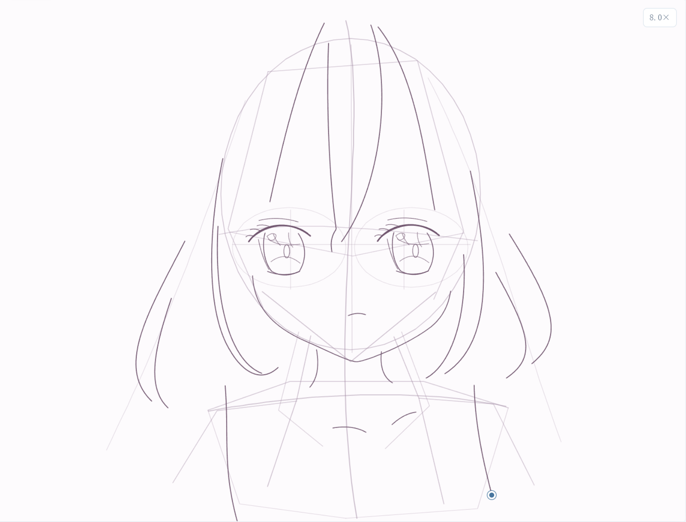
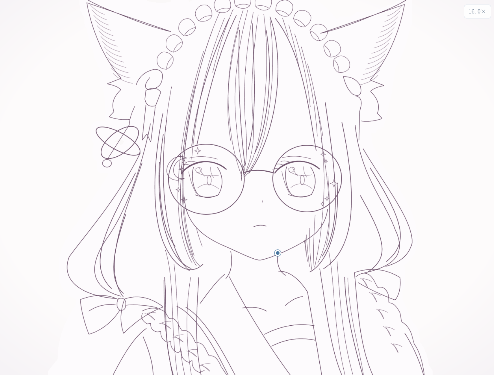
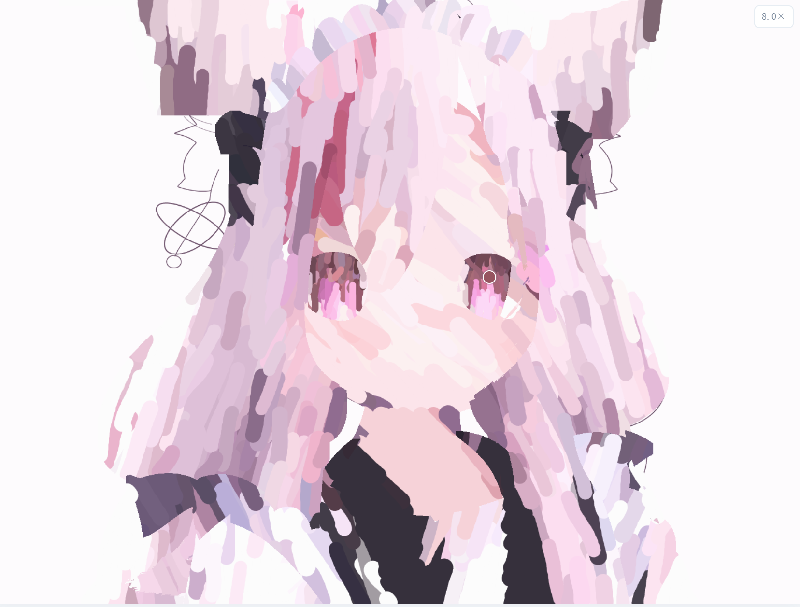
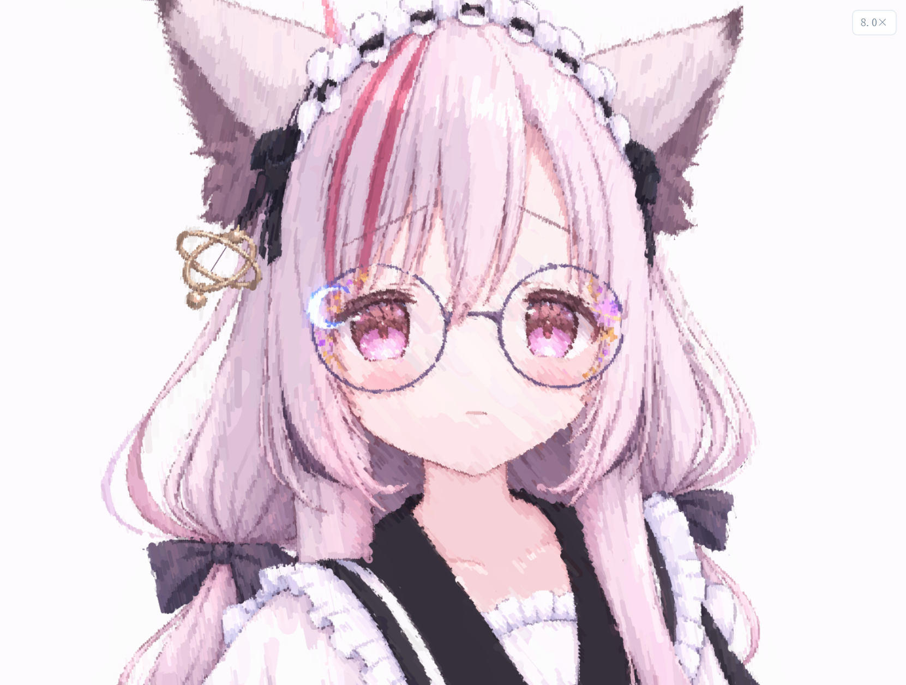

# Astra Image Copying · 羽梦OwO

使用 **GPT6-Astra**，以羽梦OwO 提供的一张人物图片为参考，完成 **SVG 矢量化临摹**，并用网页模拟从起稿、描线到上色与细化的绘画过程。

猫耳、浅粉色发丝、圆框眼镜与衣装细节逐笔浮现。这个项目既保存了可下载的矢量作品，也让观看者能够跟随笔触，看看一幅肖像如何慢慢成形。

[下载 SVG 作品](猫耳少女上色.svg) · [羽梦的小窝](https://www.yumengovo.com/)

## 绘画过程

以下四张截图记录了网页演示中的不同阶段，按绘画顺序排列；右上角的倍速是截图时的播放设置。

| ① 草稿与结构定位 | ② 轮廓与细节描线 |
| :---: | :---: |
|  |  |
| 用轻线确定比例、姿态与五官位置。 | 沿轮廓描线，补上发束、镜框与衣装细节。 |

| ③ 铺色与色块建立 | ④ 阴影、高光与细化 |
| :---: | :---: |
|  |  |
| 用较宽的笔触铺开主色，建立画面的配色关系。 | 用更细的笔触补充阴影、高光与局部纹理。 |

截图保存在 `docs/process/`，供 README 展示。

## 网页体验

- **13 个阶段**：动态线 → 比例定位 → 轮廓结构 → 五官描线 → 头发与猫耳 → 衣服 → 饰品 → 擦除草稿与修线 → 肤色 → 头发与兽耳上色 → 服装上色 → 眼睛上色 → 阴影与高光。
- **控制播放**：暂停、继续、从头重播，支持 1×、2×、4×、8×、16× 倍速，默认 8×。1× 的编排时长为 15 分 49 秒。
- **逐笔查看**：拖动进度条或点击阶段跳转；“下一笔”按钮可以暂停并完成下一笔，“查看成稿”跳到动画完成状态。
- **跟随视角**：镜头随当前绘制部位移动，也可切换全景或手动缩放，手动范围为 1–4 倍。
- **键盘操作**：空格播放 / 暂停，左右方向键前后移动 5 秒。
- **保存作品**：点击“下载作品 SVG”，获取矢量成稿。系统开启减少动态效果时，页面不会自动播放。

## 本地运行

这是由 HTML、CSS 与 JavaScript 组成的静态网页，播放器使用浏览器 Canvas 2D 绘制。运行现有作品无需构建，也无需配置 AI API 密钥。

克隆仓库后，在仓库根目录启动静态服务器。例如，已安装 Python 时可以运行：

```bash
git clone https://github.com/YumengOvO/Astra-image-copying.git
cd Astra-image-copying
python -m http.server 8000
```

然后在浏览器中打开 [http://localhost:8000](http://localhost:8000)。也可以使用其他静态服务器；发布时保持文件的相对路径即可。

## 文件说明

| 文件 | 用途 |
| --- | --- |
| `index.html` / `styles.css` | 网页结构、播放控件与界面样式。 |
| `app.js` | 13 个阶段的调度、逐笔绘制、进度控制与镜头跟随。 |
| `strokes.js` | 描线阶段的路径与笔画数据。 |
| `paint-strokes.js` | 上色、阴影、高光与局部细化的笔画数据。 |
| `猫耳少女上色.svg` | 可下载的 SVG 矢量作品。 |
| `猫耳少女画纸.png` | 播放器使用的画纸素材。 |
| `color-mask-*.png` / `猫耳少女上色-收尾.png` | 限定绘制区域的遮罩素材。 |
| `docs/process/` | 本文展示的四张绘画过程截图。 |

## 矢量作品与过程演示

SVG 成稿与网页动画分别承担作品保存和过程展示。网页根据预先编排的线条与彩色笔触数据，逐步绘制画面；它是一次模拟绘画过程的演示，不是原图作者的真实笔迹录像，也不是 GPT6-Astra 生成过程的实时录屏。

动画通过硬边笔触近似参考图的构图与配色，因此笔触纹理与下载的 SVG 成稿会有所不同。“查看成稿”展示动画的完成状态，“下载作品 SVG”提供独立的矢量文件。

## 署名与许可

参考图片由羽梦OwO 提供，SVG 矢量化临摹与网页过程模拟使用 GPT6-Astra 完成。

仓库附带 [MIT License](https://github.com/YumengOvO/Astra-image-copying/blob/main/LICENSE)。